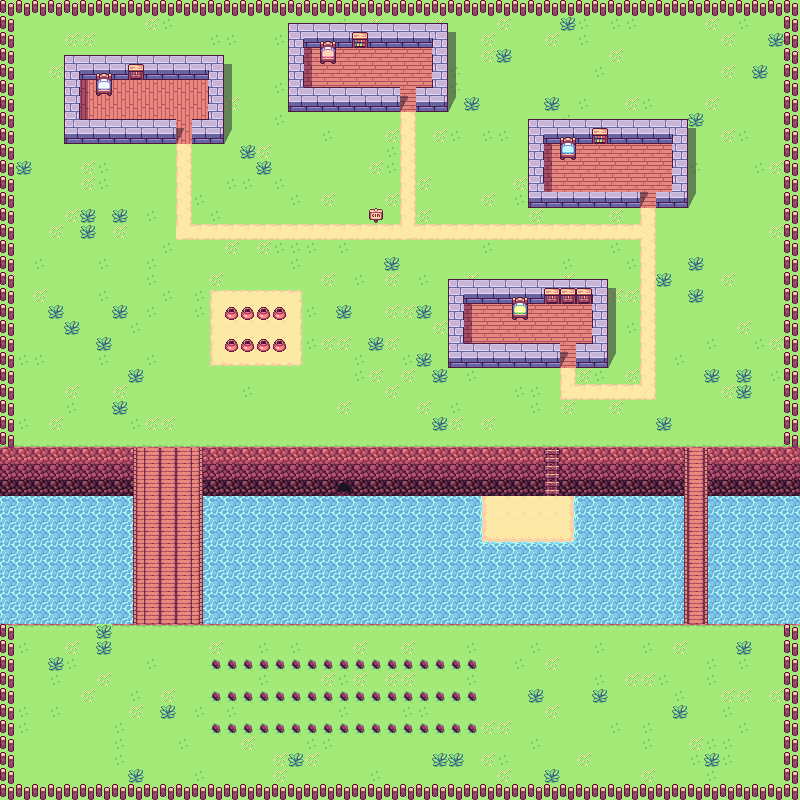

# BotPlot

## LLM 

`gpt-3.5-turbo` via OpenAI API

## Run locally

BotPlot is currently created for local deployment:

1.  `agent/env.json`- add OpenAI API key.  
2. Run `npm install` in root directory.
3. Run `npm start` in root directory.  

BotPlot agent front-end should be available at `http://localhost:3000`.

## The Environment

### Breakdown:
* Agent
* Impassable tiles
* A plant layer with "plantable" tiles, and plants (not currently in use by agent).
* On plantable tiles:
-  Press `S` to plant food 
-  Press `D` to harvest food

### Files:
- `ui-admin`- all code for environment.
- [Tiled](https://www.mapeditor.org/) - map editor. Files can be found at `ui-admin/src/assets`.
- [Phaser](https://phaser.io/) + [Grid Engine Plugin](https://annoraaq.github.io/grid-engine/) - environment rendering.

## The Agent

- `agent`- all code for agent.
- OpenAI API for decision-making + communicating with the front-end (via wss).
- Agent has: list of `Actions`, ability to evaluate `Surroundings`, and measure self `Sleepiness`.

